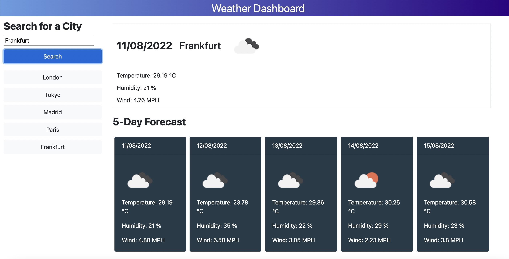

# Weather-Forecast
A website to search for current weather and 5 day weather forecasts for a city of interest.

### Links to the webpage and repository

To access the website use [Weather-Forecast](https://haruka08.github.io/Weather-forecast/)

To access the GitHub repository use [GitHub Repository Weather-Forecast](https://github.com/Haruka08/Weather-forecast)

## Content

The website consists of following 3 sections:

1. Search & search history
    - using the user input section, enter a city of interest to search for the local weather
    - once a city is searched, it is listed below and it can be searched again without searching for the same city again

2. Current weather
    - The section consists of the following information
        - date
        - city
        - weather icon
        - temperature
        - humidity

3. 5 day forecast
    - this section shows 5 days forecast of the local weather consisting of the following information
        - date
        - weather icon
        - temperature
        - humidity

## Screenshot of the website

